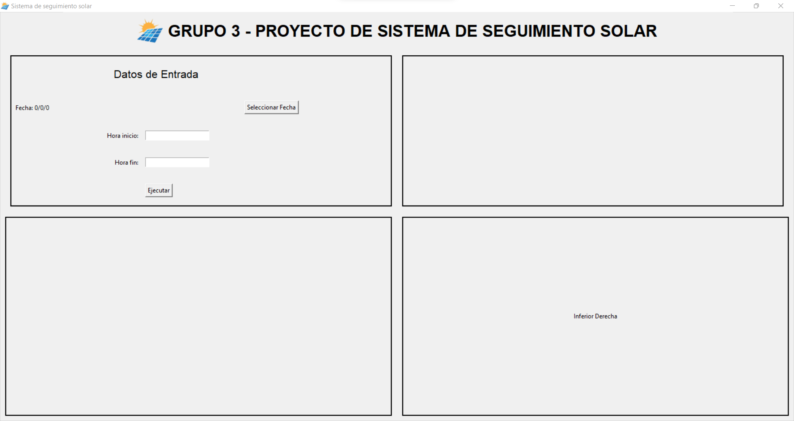

# Proyecto Seguidor Solar 🔥 ☀️
Un seguidor solar es un sistema de orientación para maximizar la exposición a la luz solar. Esto se consigue cuando el panel solar se orienta perpendicularmente a la luz solar incidente. Cuando el panel no se encuentra perpendicular, la cantidad de energía generada disminuye significativamente. ⛅


## Directorio Principal 🚀
En el directorio principal tenemos múltiples colab pero el principal para la simulación es: ProyectovTest.ipynb, dentro está la lógica para ejecutar las simulaciones sin necesidad de la interfaz y hacer correctamente los cálculos.

## Interfaz 💻
La interfaz tiene como propósito facilitar la visualización de los resultados dados por el seguidor solar.

### Instalar prerequisitos ❗
Para instalar los prerequisitos del proyecto ejecute:
```bash
pip install -r requirements.txt
```
Esto instalar los paquetes que *pipreqs* encontró y usó para crear requirements

### Pasos para Ejecutar la Interfaz 🚩
Para iniciar la interfaz del proyecto, ejecuta el siguiente comando en tu terminal:

```bash
cd ./Interfaz-SeguidorSolar
python ./app.py
```
Con esto se ejecutará la interfaz gráfica.

### Ejecución
La interfaz tiene como propósito facilitar la visualización de los resultados dados por el seguidor solar.


### Archivos de interfaz
La función de la interfaz debe consumir varias funciones, con esto en mente, se crearon copias que fueron adaptados específicamente a la interfaz para que puedan funcionar, por eta razón existen archivos dentro de interfaz que tienen las mismas funciones que el directorio BackEndSeguidorSolar

## BackEndSeguidorSolar
El directorio contiene los archivos esenciales de las simulaciones y la creación de los gráficos.

Estos archivos no son consumidos por la Interfaz por problemas al momento de importar.

### ResoluciónRotaciones
El archivo ResoluciónRotaciones contiene la función **calculate_solar_positions** que contiene la lógica para obtener los ángulos de Azimuts, altitud, ritch y roll.

Este se utliza en otras partes del código